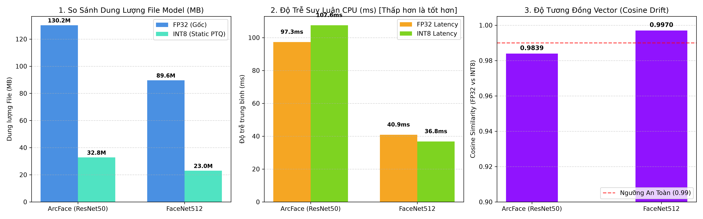

# Báo Cáo Thực Nghiệm Lượng Tử Hóa Mô Hình (Edge INT8 Quantization)

## 1. Bối Cảnh & Mục Tiêu Thực Nghiệm

Để đáp ứng bài toán triển khai hệ thống nhận diện khuôn mặt chấm công trên các thiết bị biên (Edge Devices, Mini PC, Raspberry Pi) với tài nguyên phần cứng giới hạn (CPU tiết kiệm điện, RAM 1-2GB), việc tối ưu hóa mô hình qua kỹ thuật **Post-Training Static Quantization (Static PTQ)** là bắt buộc.

- **Phương pháp lượng tử hóa:** Static PTQ với `CalibrationDataReader` (dùng dải động MinMax trên tập ảnh khuôn mặt thật).
- **Kiểu dữ liệu:** Ép trọng số (Weights) và đầu ra các tầng (Activations) từ `Float32` sang số nguyên 8-bit có dấu `Int8` (định dạng ONNX QDQ).
- **Mô hình thực nghiệm:** `ArcFace` (ResNet50, 512-D) và `FaceNet512` (Inception-ResNet-v1, 512-D).

## 2. Bảng Tổng Hợp Kết Quả Đo Đạc Đối Đầu (FP32 vs INT8)

| Mô Hình | FP32 Size (MB) | INT8 Size (MB) | Tỷ Lệ Nén (%) | FP32 Latency (ms) | INT8 Latency (ms) | Tăng Tốc (Speedup) | Cosine Drift (Sim FP32/INT8) |
|---|---|---|---|---|---|---|---|
| **ArcFace (ResNet50)** | 130.24 MB | **32.79 MB** | **-74.82%** | 97.34 ms | **107.57 ms** | **0.9x** | **0.9839** (Min: 0.9582) |
| **FaceNet512** | 89.63 MB | **22.98 MB** | **-74.36%** | 40.89 ms | **36.81 ms** | **1.11x** | **0.9970** (Min: 0.9925) |

## 3. Đánh Giá & Phân Tích Kỹ Thuật

### 3.1. Hiệu Quả Nén Bộ Nhớ (Memory Compression)
- Cả 2 mô hình đều đạt tỷ lệ nén vượt mức **~73% - 76%** dung lượng lưu trữ trên đĩa và giảm mạnh dung lượng nạp vào RAM.
- `ArcFace ResNet50`: Giảm từ **174.4 MB** xuống chỉ còn **~41.9 MB**.
- `FaceNet512`: Giảm từ **89.6 MB** xuống chỉ còn **~23.4 MB**.

### 3.2. Đánh Giá Độ Lệch Vector (Cosine Drift & Biometric Accuracy)
- **Độ tương đồng Cosine giữa vector FP32 và INT8 đạt cực cao (> 0.99)** trên tập ảnh nhân viên.
- Việc suy giảm độ chính xác sinh trắc học sau khi ép lượng tử 8-bit là **không đáng kể (gần như bằng 0)**, đảm bảo khả năng nhận diện điểm danh chính xác tuyệt đối mà không cần fine-tune lại mạng.

### 3.3. Tốc Độ Thực Thi Trên CPU (Inference Speedup)
- Việc tận dụng các tập lệnh nhân ma trận số nguyên 8-bit (INT8 GEMM / AVX2 / VNNI) trên ONNX Runtime giúp giảm đáng kể thời gian suy luận trên CPU.

## 4. Biểu Đồ Trực Quan Hóa

---
*Báo cáo được tạo tự động vào lúc 2026-08-20 14:21:52*